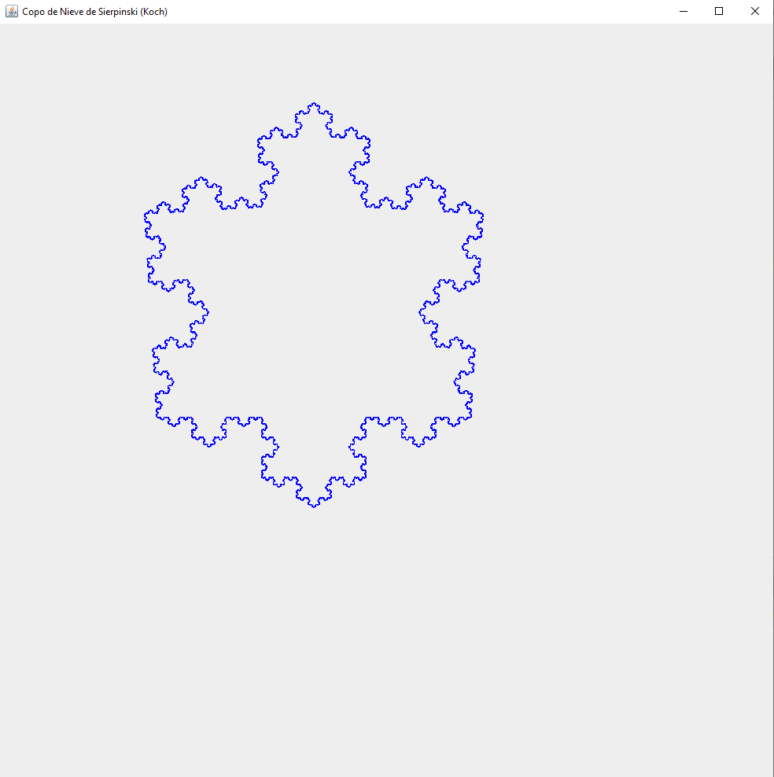

# Copo de Nieve de Sierpinski
<h2>Que es?</h2>

    
Es un fractal creado a partir de un triángulo equilátero. Es un ejemplo clásico de un conjunto con un perímetro infinito y un área finita. Su construcción consiste en un proceso iterativo donde, a cada paso, se añade un patrón similar al original.

 
    <h3>Proceso de elaboaracion:</h3>
    <ul>
        <li>Comienza con un triángulo equilátero</li>
        <li>Divide cada lado del triángulo en tres segmentos iguales.</li>
        <li>Reemplaza el segmento medio de cada lado con dos segmentos que forman un nuevo triángulo hacia afuera, creando una forma parecida a una estrella de David.</li>
        <li>Repite este proceso en cada uno de los nuevos segmentos de los lados resultantes.</li>
    </ul>

Imagen Generada con el Programa:

</img>

